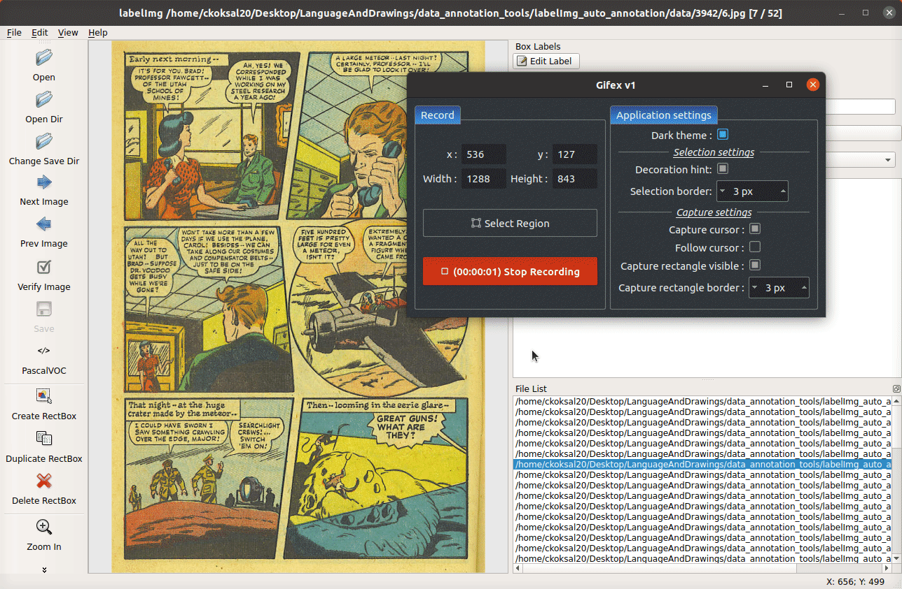

# labelImg_auto_annotation
This aims to leverage existing object detectors to ease data annotation process by automatically detecting the objects in the image. You can correct the bounding boxes that are detected by the object detector. The project is based on the [LabelImg](https://github.com/tzutalin/labelImg.git). For the auto-annotation, [mmdetection](https://github.com/open-mmlab/mmdetection) library is used.

